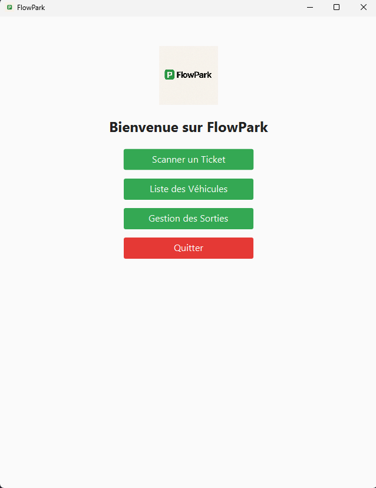

## Project Overview

**FlowPark** is a Java application for managing a long-term parking lot.  
It allows users to:
- Scan parking tickets and extract entry information using OCR (Tesseract)
- Store vehicle data (entry/exit) in an SQLite database
- Display the list of currently parked vehicles
- Calculate the parking fee based on parking duration
- Remove the vehicle after payment

---

## Main Features

### License Plate Scanning (OCR)
When a vehicle enters, its license plate is scanned using **Tesseract OCR**.  
The following information is automatically recorded:
- License plate number  
- Entry date and time  
- Unique vehicle ID  
- Expected exit date and time  

### Database Management
All data are stored in an **SQLite database** using the **Repository design pattern**, ensuring a clean separation between logic and persistence.

### Ticket Generation
A parking ticket is generated containing:
- License plate  
- Entry time  
- Vehicle ID  
- Expected exit time  

### Vehicle List Display
Displays the list of all vehicles currently in the parking lot, updated dynamically.

### Exit and Fee Calculation
Upon exit:
1. The customer scans their ticket.  
2. The system retrieves the data via the unique ID.  
3. The total parking duration is calculated.  
4. The total price is computed according to a predefined hourly rate.  
5. The vehicle is removed from the database after payment.

### Use of Threads
Threads are used to improve performance and maintain a responsive interface:
- Plate scanning  
- Vehicle list updating  
- Fee calculation  

---

## Architecture

The project follows the **Model-View-Controller (MVC)** architecture.

### Clone the Repository
```bash
git clone https://github.com/your-username/FlowPark.git
cd FlowPark
```
### Build and Run the Project
```bash
mvn clean install
mvn javafx:run
```
## Screenshots

### Main Interface


### Plate Scan


### Vehicle List


### Vehicle out

---
