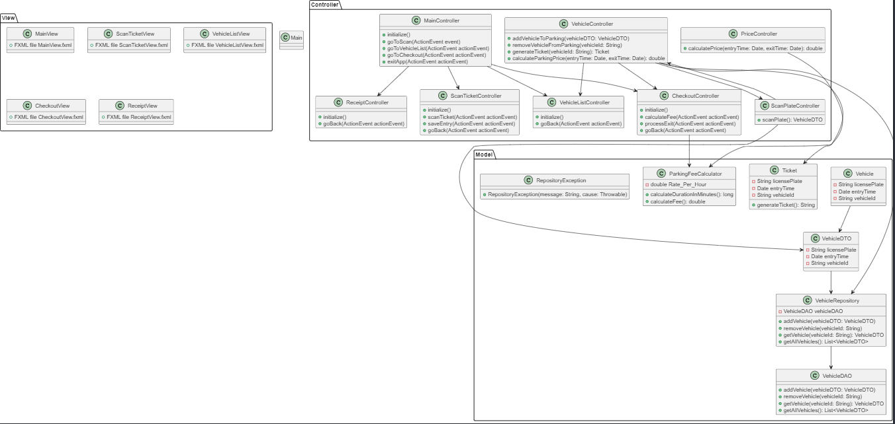

# Nom du Projet

      

## Auteurs

- Groupe D112
- g63549 Nazmi
- g61300 Daylan

## Description du Projet

Ce projet est une application Java permettant de gérer un parking longue durée, donc scanner des tickets de parking pour extraire l'heure d'entrée et le numéro de plaque, stocke les enregistrements entrées/sorties sur une db, capable d'afficher la liste des véhicules présents, capable de calculer le tarif en fontction de la durée de stationnement et supprimer le véhicule de la liste avec le prix à payer.


###  Fonctionnalités principales :

### 📷 Scan de plaque et extraction de données
À l’entrée, la plaque du véhicule est scannée à l'aide de l'OCR Tesseract. Le système enregistre automatiquement les informations suivantes :
- Numéro de plaque
- Date et heure d'entrée
- Identifiant unique (ID)
- Date et heure de sortie attendus 

### 💾 Stockage en base de données
Ces données sont ensuite stockées dans une base de données (table Vehicle) en respectant le design pattern Repository, qui conserve les informations des véhicules actuellement présents dans le parking.

### 🧾 Génération d’un ticket
Un ticket de parking est généré pour le client, contenant les informations nécessaires (numéro de plaque, date et heure d’entrée, ID, date et heure de sortie).

### 🚗 Affichage des véhicules présents
L’application est capable d’afficher dynamiquement la liste de tous les véhicules encore présents dans le parking.

### 💰 Sortie et calcul du tarif
Lors de la sortie :
1. Le client scanne son ticket de parking
2. Le système retrouve les données en base via l’ID
3. Il calcule le temps de stationnement
4. Il calcule et affiche le prix à payer (en fonction d’une formule définie selon la durée)
5. Le véhicule est alors supprimé de la base de données

### 🧵 Utilisation des Threads

Les threads dans ce projet sont utilisés dans plusieurs parties de l'application pour améliorer les performances et éviter de bloquer l'interface utilisateur.

- **Scan de plaque** : Un thread gère le scan de la plaque du véhicule à l'entrée, permettant au système de fonctionner sans interruption.
  
- **Lecture des véhicules présents** : Un thread met à jour dynamiquement la liste des véhicules présents dans le parking, assurant un affichage fluide.
  
- **Calcul du tarif** : Lors de la sortie, un thread calcule le tarif de stationnement sans bloquer l'interface, garantissant une expérience utilisateur réactive.


## Diagramme de Classe

Le diagramme de classe ci-dessous illustre la structure du modèle de l'application. 



## Choix de l'Architecture

L'architecture retenue pour ce projet est _model-view-controller_. 


## Plan de Tests Fonctionnels

## Tests et Résultats Attendus

| ID    | Test                                | Données d'entrée                                       | Résultat attendu                                        |
|-------|-------------------------------------|--------------------------------------------------------|---------------------------------------------------------|
| T1    | Scan OCR correct de plaque              | Plaque = "ABC1234", Heure d'entrée = 14:30              | Lancement du calcul, ticket généré                      |
| T2    | Valeur de plaque invalide           | Plaque = "1234" (format incorrect)                      | Message d'erreur et retour à la saisie                  |
| T3    | Données manquantes                  | Plaque = "", Heure d'entrée = "abc"                     | Message d'erreur et retour à la saisie                  |
| T4    | Calcul du tarif                     | Temps de stationnement = 3h30, Tarif horaire = 2€/h      | Prix à payer = 7€                                        |
| T5    | Affichage des véhicules présents    | Parking avec 10 véhicules                              | Affichage de la liste des véhicules présents             |
| T6    | Thread de scan de plaque            | Plaque = "XYZ9876", Heure d'entrée = 09:00               | Scan de plaque sans interruption                        |
| T7    | Thread de lecture des véhicules     | Nombre de véhicules = 5                                | Liste des véhicules mise à jour dynamiquement           |
| T8    | Thread de calcul du tarif           | Temps de stationnement = 1h15                           | Calcul du tarif sans bloquer l'interface utilisateur    |
| T9    | Suppression d'un véhicule           | Plaque = "ABC1234"                                      | Le véhicule est supprimé de la liste après paiement     |
| T10   | Performance de gestion des tickets  | Nombre de véhicules = 50                               | Temps de traitement des tickets optimisé avec threads   |
| T11   | Relancer le calcul après modification | Modifier la taille du parking et relancer le calcul    | Les nouveaux résultats sont affichés correctement       |


## Calendrier Hebdomadaire des Tâches

### Semaine 1 - 6H

| Qui       | Description  
|--         | --
|Tous       | Analyse du projet.
|Nazmi      | Initialisation de Git
|Daylan     | Configuration de l'environnement de développement

### Semaine 2 - 6H

| Qui       | Description
|--         | --  
|Tous       | Recherche et intégration de l'OCR
|Nazmi      | Développement du module de scan des tickets
|Daylan     | Création et configuration de la base SQLite


### Semaine 3 - 6H

| Qui       | Description  
|--         | --
|Tous       | Définition des interfaces utilisateur (maquettes)
|Nazmi      | Développement des fichiers FXML et contrôleurs
|Daylan     | Liaison entre les vues et la base de données

### Semaine 4 - 6H

| Qui       | Description 
|--         | -- 
|Tous       | Implémentation des fonctionnalités principales
|Nazmi      | Gestion des entrées et sorties des véhicules
|Daylan     | Calcul et affichage du tarif de stationnement

### Semaine 5 - 6H

| Qui       | Description
|--         | --  
|Tous       | Réalisation des tests fonctionnels
|Nazmi      | Débogage et optimisation
|Daylan     | Validation de l’interface utilisateur

### Semaine 6 - 6H

| Qui       | Description  
|--         | --
|--         | Finalisation et correction des bugs
|Nazmi      | Finaliser la rédaction de la documentation (README.md)
|Daylan     | Présentation et préparation du rendu
...


## Installation et utilisation

Pour utiliser l'application, suivez les étape suivantes : 

1. Clonez ce repository :
   ```bash
   git clone ...
   ```

2. Démarrez le projet en exécutant la commande 
   ```bash
   mvn ...
   ```


## Problèmes connus de l'application

Lors de la réalisation des tests fonctionnels, nous avons constatés les problèmes suivants : 

- ...

## Retrospective

Nous avons constaté les différences suivantes entre le diagramme de classes imaginés au départ et l'implémentation réalisée : 

- ...


## Logo FlowPark


